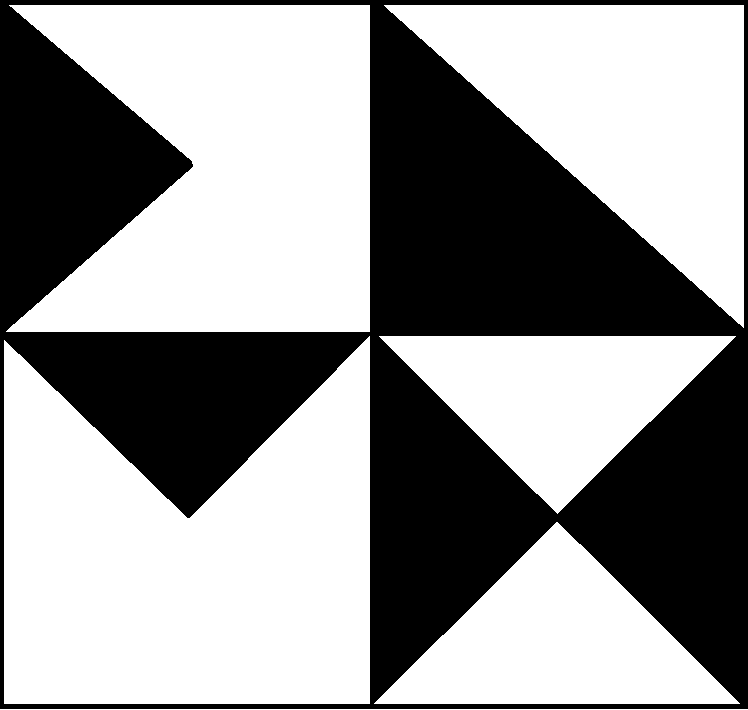

# xDNMX Brand Guidelines

## The xDNMX Identity

xDNMX = Extended Dynamics. The brand reflects what we are: an open network connecting discovery and building, powered by AI-assisted research.

### Brand Personality

- **Open** — Accessible, welcoming, no gatekeeping
- **Foundational** — Serious about ideas, focused on *why*
- **Energetic** — Excited about discovery, fun to be part of
- **Technical** — Credible, precise, engineering-minded
- **Human** — Despite the AI focus, it's about people connecting

---

## Color Palette

### Primary Colors

| Color | Hex | RGB | Usage |
|-------|-----|-----|-------|
| **Primary Blue** | `#2563EB` | 37, 99, 235 | Primary brand color, headlines, buttons, links |
| **Deep Navy** | `#1E293B` | 30, 41, 59 | Body text, dark backgrounds, contrast |

### Secondary Colors

| Color | Hex | RGB | Usage |
|-------|-----|-----|-------|
| **Electric Cyan** | `#06B6D4` | 6, 182, 212 | Discoveries, highlights, AI/tech elements |
| **Warm Orange** | `#F97316` | 249, 115, 22 | Builds, calls to action, energy, engagement |

### Neutral Colors

| Color | Hex | RGB | Usage |
|-------|-----|-----|-------|
| **Light Gray** | `#F1F5F9` | 241, 245, 249 | Backgrounds, cards, subtle separation |
| **Medium Gray** | `#64748B` | 100, 116, 139 | Secondary text, captions |
| **White** | `#FFFFFF` | 255, 255, 255 | Clean space, high contrast areas |

### Color Combinations

**Light mode:**
- Background: White or Light Gray
- Text: Deep Navy
- Accents: Primary Blue + Electric Cyan or Warm Orange

**Dark mode:**
- Background: Deep Navy or `#0F172A`
- Text: White or Light Gray
- Accents: Electric Cyan + Warm Orange

### Semantic Colors

| Purpose | Color | Meaning |
|---------|-------|---------|
| Discovery | Electric Cyan | Research, findings, exploration |
| Building | Warm Orange | Engineering, implementation, action |
| Connection | Primary Blue | Collaboration, network, community |

---

## Typography

### Font Families

**Primary: Inter**
- Open source, highly legible, works everywhere
- Download: [Google Fonts](https://fonts.google.com/specimen/Inter)
- Use for: Body text, UI elements, most content

**Headlines: Space Grotesk (alternative)**
- Distinctive, technical feel
- Download: [Google Fonts](https://fonts.google.com/specimen/Space+Grotesk)
- Use for: Event titles, hero text, major headlines

**Monospace: JetBrains Mono**
- For code, technical content, the "x" in xDNMX
- Download: [JetBrains](https://www.jetbrains.com/lp/mono/)
- Alternative: Fira Code

### Type Scale

| Element | Size | Weight | Line Height |
|---------|------|--------|-------------|
| Hero | 48-72px | Bold | 1.1 |
| H1 | 36-48px | Bold | 1.2 |
| H2 | 24-30px | Semi-bold | 1.3 |
| H3 | 18-20px | Semi-bold | 1.4 |
| Body | 16px | Regular | 1.6 |
| Small | 14px | Regular | 1.5 |
| Caption | 12px | Regular | 1.4 |

### Typography Rules

- **Left-align** body text (no justified text)
- **Generous line spacing** — ideas need room to breathe
- **Limit line length** to 65-80 characters for readability
- **Use hierarchy** — clear distinction between levels

---

## Logo

### The Mark

The xDNMX logo is a geometric design using black triangles on white:



- **Left side:** Triangles forming a ">" or "D" shape (pointing right — discovery)
- **Right side:** Triangles forming an "X" shape (extended, multiplication)

The design represents:
- Extended (like TEDx — anyone can run an event)
- The unknown (what we're searching for)
- Discovery → Building (the arrow pointing to the X)

### Logo Versions

1. **Primary:** Black on white (current)
2. **Inverted:** White on dark backgrounds (create as needed)
3. **With text:** Logo + "xDNMX" wordmark (create as needed)

### Construction

- Geometric triangles on a roughly square canvas
- Current file: 748 x 710 pixels
- Maintain aspect ratio when scaling

### Clear Space

Maintain clear space equal to the height of the "x" on all sides.

```
      ┌─────────────────────┐
      │                     │
      │    x D N M X        │
      │                     │
      └─────────────────────┘
         ↑ clear space = x height
```

### Minimum Size

- Digital: 24px height minimum
- Print: 0.5 inches / 12mm height minimum

### Don'ts

- Don't stretch or compress
- Don't rotate
- Don't add drop shadows or effects
- Don't place on busy backgrounds
- Don't change the colors outside the palette
- Don't rearrange elements

---

## Imagery

### Photography Style

- **Candid over posed** — real people doing real work
- **Diverse** — anyone, anywhere means *anyone, anywhere*
- **Technical environments** — whiteboards, screens, notebooks
- **Warm lighting** — inviting, not sterile

### Illustrations

- **Simple diagrams** over complex graphics
- **Hand-drawn elements** welcome (authenticity)
- **ASCII art** for technical charm
- **Network/connection** motifs

### Screenshots

- Show real repos, real code, real discussions
- Blur or redact personal information
- Dark mode screenshots preferred (technical credibility)

---

## Voice & Tone

### Voice (consistent)

- **Direct** — Say what you mean
- **Technical** — Precise language, no buzzwords
- **Inclusive** — "Anyone can contribute"
- **Curious** — Questions are good

### Tone (varies by context)

| Context | Tone |
|---------|------|
| Announcements | Energetic, exciting |
| Documentation | Clear, helpful |
| Code of conduct | Warm but firm |
| Research discussion | Rigorous, open |

### Writing Guidelines

- Use "we" and "you" (not "the organization" or "users")
- Avoid jargon unless necessary
- Short sentences. Short paragraphs.
- Active voice over passive
- Questions are welcome in copy

---

## Applications

### Event Materials

- Use the color palette consistently
- Include the logo on all materials
- Credit: "Part of the xDNMX network — xdnmx.org"

### Social Media

- Profile image: xDNMX wordmark on Deep Navy background
- Use Electric Cyan for discovery content
- Use Warm Orange for build content

### Presentations

- Dark backgrounds (Deep Navy) for technical credibility
- Light backgrounds (White/Light Gray) for accessibility
- Always include repo links

### Swag

- Keep it simple — the wordmark is enough
- Prefer useful items (stickers, notebooks) over wasteful ones

---

## Co-Branding

When running an xDNMX event with partners:

- xDNMX logo appears with partner logos, not subordinate
- Maintain clear space around all logos
- Use "xDNMX [City/Name]" naming convention
- Example: "xDNMX Berlin" or "xDNMX @ TechHub"

---

## Questions?

For brand questions or to request assets: info@xdnmx.org
